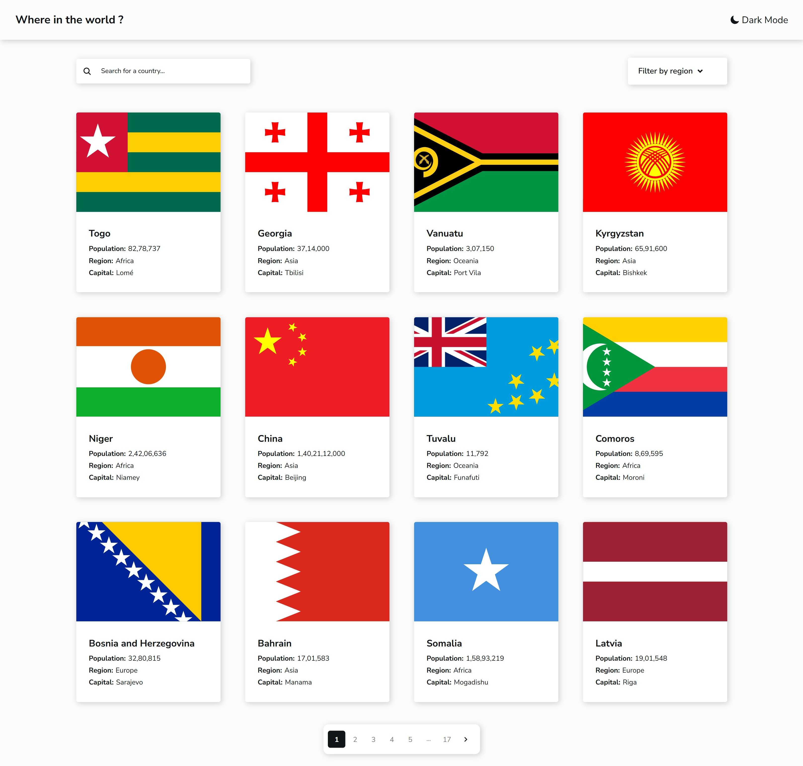

# Frontend Mentor - REST Countries API with color theme switcher solution

This is a solution to the [REST Countries API with color theme switcher challenge on Frontend Mentor](https://www.frontendmentor.io/challenges/rest-countries-api-with-color-theme-switcher-5cacc469fec04111f7b848ca). Frontend Mentor challenges help you improve your coding skills by building realistic projects. 

## Table of contents

- [Overview](#overview)
  - [The challenge](#the-challenge)
  - [Screenshot](#screenshot)
  - [Links](#links)
- [My process](#my-process)
  - [Built with](#built-with)
  - [What I learned](#what-i-learned)
- [Author](#author)


## Overview

### The challenge

Users should be able to:

- See all countries from the API on the homepage
- Search for a country using an `input` field
- Filter countries by region
- Click on a country to see more detailed information on a separate page
- Click through to the border countries on the detail page
- Toggle the color scheme between light and dark mode *(optional)*

### Screenshot




### Links

- Solution URL: [Add solution URL here](https://your-solution-url.com)
- Live Site URL: [Add live site URL here](https://your-live-site-url.com)


### Built with

- Semantic HTML5 markup
- CSS custom properties
- Flexbox
- CSS Grid
- RESPONSIVE
- [React](https://reactjs.org/) - JS library
- [React Icons](https://react-icons.github.io/react-icons/) -Icons 


### What I learned

-PAGINATION 

```
const pagesToShowAround = () => {
    //if totalPages is less then 6 or 4
    if (totalPages <= size + 2) {
      return [...pageRange(1, totalPages)];
    } else {
      // if currentPage less then is 5 or 3
      if (currentPage <= size + 1) {
        //show pagination (1 2 3 4 5 ... 17) or (1 2 3 ...17) -->small screen
        return [...pageRange(1, size + 1), "right-ellipses", totalPages];
      } else if (currentPage >= totalPages - size) {
        //show pagination (1... 13 14 15 16 17) or (1...15 16 17)-->small screen
        return [
          1,
          "left-ellipses",
          ...pageRange(totalPages - size, totalPages),
        ];
      }

      //show sibling count  for large screen   (1 ... 4 5 6 ...17) for small screen   (1...5...17)
      const siblingCount = screenSize <= 395 ? 0 : 1;

      const leftElementSibling = Math.max(currentPage - siblingCount, 1); //leftElementSibling 4
      const rightElementSibling = Math.min(
        currentPage + siblingCount,
        totalPages
      );//rightElementSibling 5

      //show right ellipses when right value is less then  example  15 < 17 - 1
      const showRightEllipses = rightElementSibling < totalPages - 1;

      //MIDDLE RANGE (1 ... 4 5 6 ...17) for small screen   (1...5...17)
      return [
        1, //-> starting page
        "left-ellipses",
        ...pageRange(leftElementSibling, rightElementSibling),
        //  if true show ellipses or []
        ...(showRightEllipses ? ["right-ellipses"] : []),
        totalPages, //--> end page
      ];
    }
  };

  const visiblePageButton = pagesToShowAround();
```


## Author

- Github - [Ashish777Dev](https://github.com/Ashish777Dev)
- Frontend Mentor - [Ashish777Dev](https://www.frontendmentor.io/profile/Ashish777Dev)


